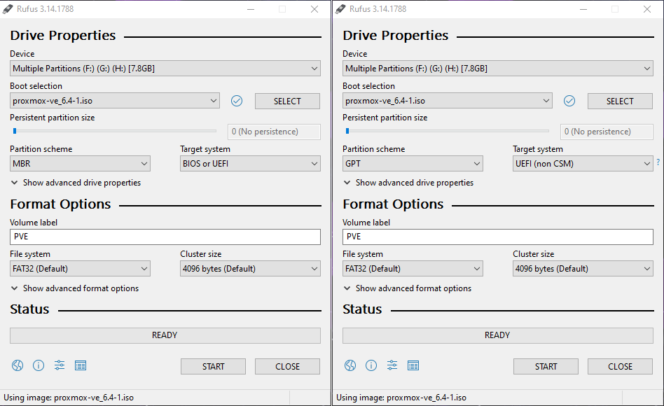
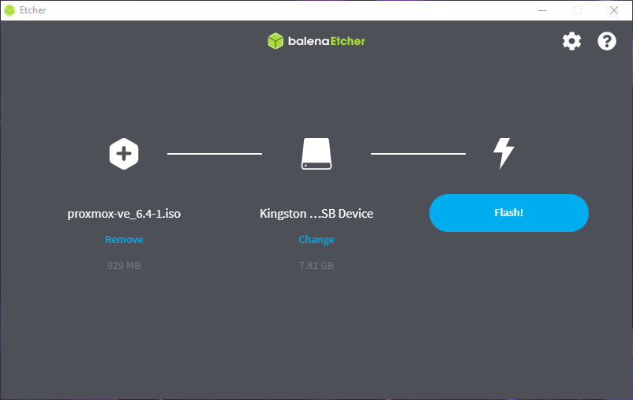

# Création du média d'installation
!!! attention "Attention"
	Pour commencer ce tuto il vous faut vous munir d'éléments suivant ;

	* Un ordinateur
  	* Du logiciel [Rufus](https://rufus.ie/fr/) ou [BalenaEtcher](https://www.balena.io/etcher/)
  	* Une clé USB de minimum 4Go
  	* L'iso de Proxmox trouvable [ici](https://www.proxmox.com/en/downloads/category/iso-images-pve)

## Windows

=== "Rufus"

	Procédez comme suit :
   	
    1. Connectez votre clé USB d'au moins 4Go dans votre ordinateur.
	2. Ouvrez [Rufus](https://rufus.ie/fr/).
   	3. Sélectionnez l'iso de Proxmox que vous avez téléchargé.
   	4. Vérifiez qu'il s’agit bien de votre clé USB qui s'affiche tout en haut de Rufus.
   	5. Sélectionnez correctement le type de Bios de la machine où Proxmox sera installé. (Bios ou UEFI)
	6. Appuyez sur Start.
	7. Sélectionnez le mode **"DD"**
	
	

=== "BalenaEtcher"
  
 	Procédez comme suit :
 	
	1. Connectez votre clé USB d'au moins 4Go dans votre ordinateur.
	2. Ouvrez [BalenaEtcher](https://www.balena.io/etcher/).
	3. Sélectionnez l'iso de Proxmox que vous avez téléchargé.
	4. Vérifiez qu'il s'agit bien de votre clé USB qui s'affiche au millieu de la fenêtre de BalenaEtcher
	5. Appuyez sur Flash!.
		
	

## MacOS
=== "BalenaEtcher"
  
	Procédez comme suit 
	 
	1. Connectez votre clé USB d'au moins 4Go dans votre ordinateur.
	2. Ouvrez [BalenaEtcher](https://www.balena.io/etcher/).
	3. Sélectionnez l'iso de Proxmox que vous avez téléchargé.
	4. Vérifiez qu'il s'agit bien de votre clé USB qui s'affiche au millieu de la fenêtre de BalenaEtcher
	5. Appuyez sur Flash!.
	
	

## Linux
Si vous utilisez déjà Linux, je pars du principe que vous vous y connaissez déjà assez pour créer une clé d'installation ;)
