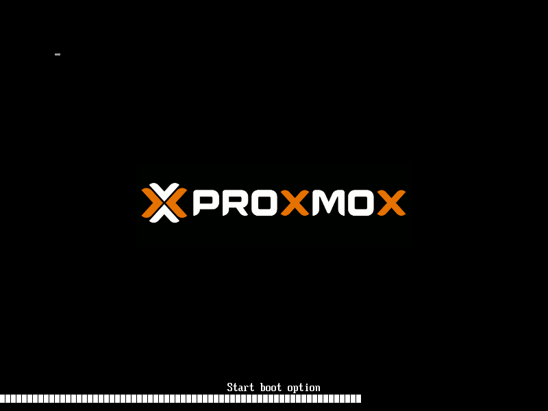
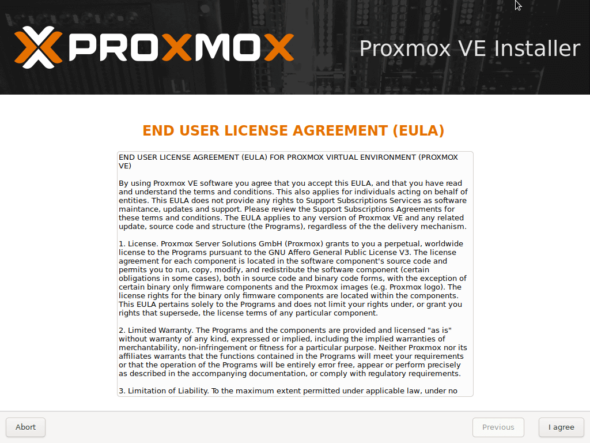
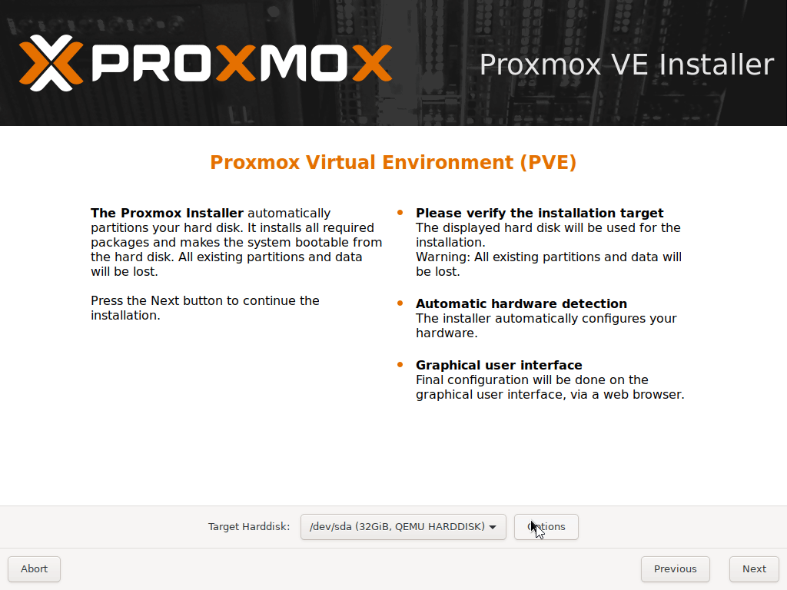
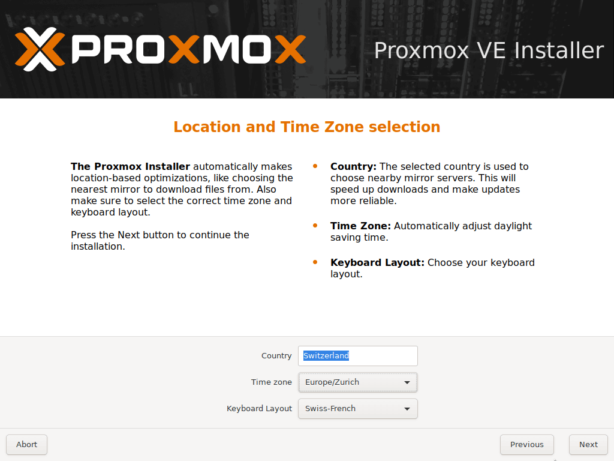
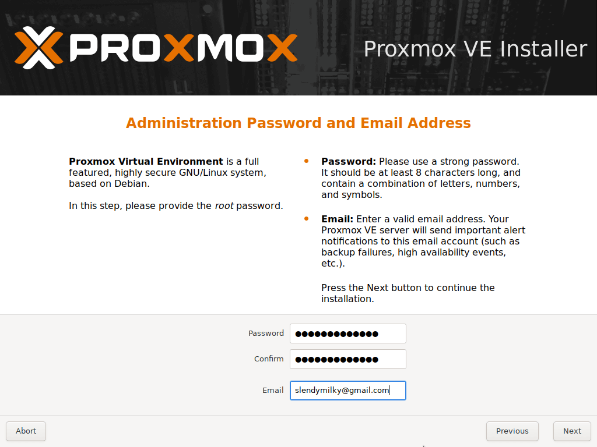
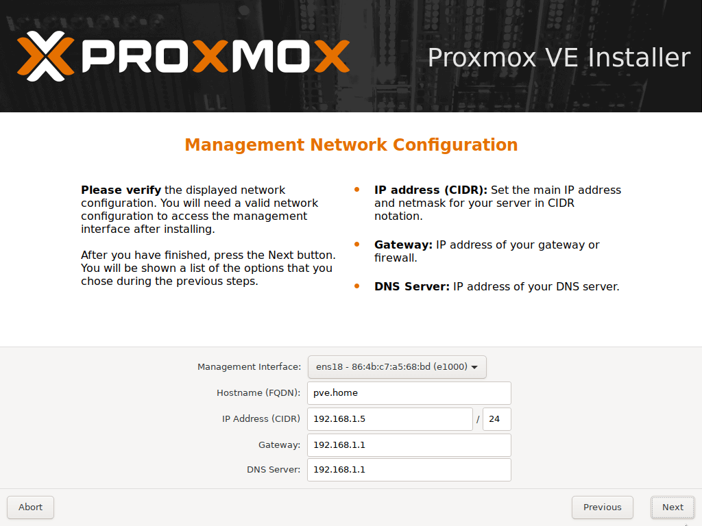
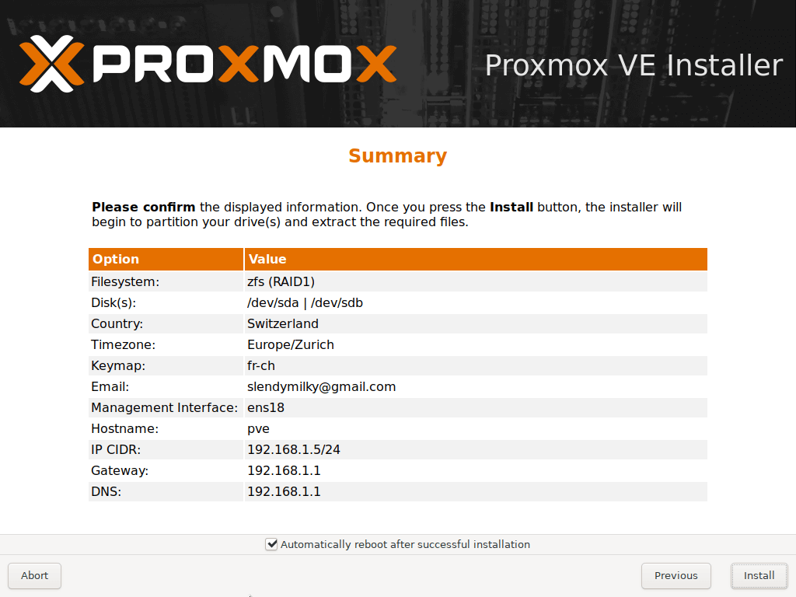
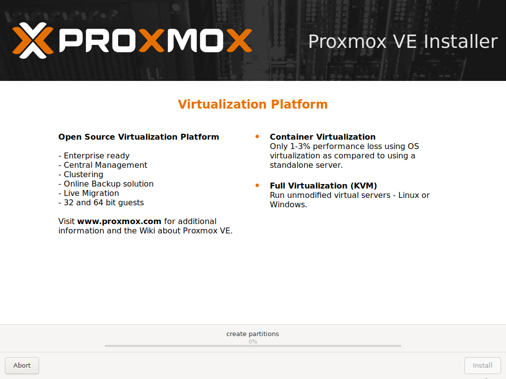
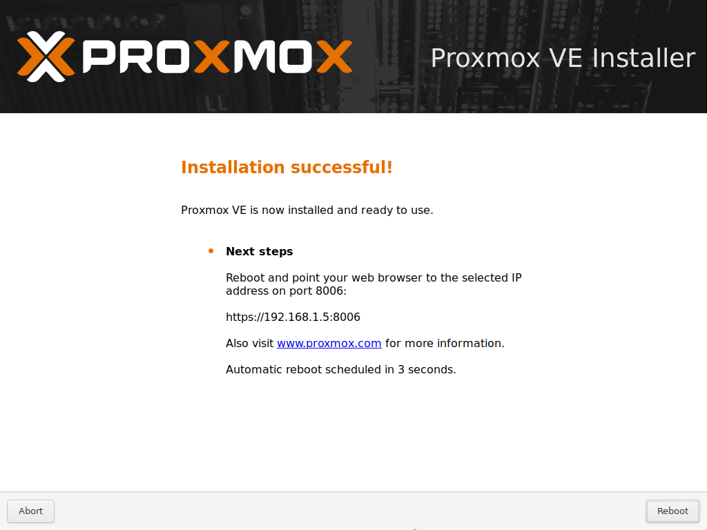

# Installation de Proxmox
!!! Info 
	**Pour les besoins du tutoriel l'installation se fera dans une machine virtuelle. Cela veut dire donc qu'il vous faudra chercher comment démarrer sur votre ISO de Proxmox**
	
	Ce tuto est réalisé avec la version ==pve-6.4-1==

## Étape 1 : Premier lancement
Bien, nous allons commencer par lancer l'installation de Proxmox. Il se peut que Proxmox vous affichent des erreurs ou autre.

<a href="../../../assets/Proxmox/2.Installation/insta_etape_1.png"></a>

Cela n'est pas grave temps que vous arrivez sur cette partie (Voir ci-dessous). Il ne vous reste plus qu'à appuyer sur enter afin de lancer la procédure d'installation.

<div style="text-align: center">
	<a href="../../../assets/Proxmox/2.Installation/insta_etape_1.1.png">
		
	</a>
</div>

Bien, on peut maintenant lire assidument les conditions générales d'utilisation.

<a href="../../../assets/Proxmox/2.Installation/insta_etape_1.2.png"></a>

## Étape 2 : Sélection des disques
Maintenant nous allons être face à un choix. (Choix désigné majoritairement par le hardware à votre disposition).

Essentiellement trois choix (pas que trois mais on restera là-dessus) s'offre à vous, le premier est l'installation sur un simple disque, donc pas de sécurité en cas de panne mais le plus simple. Il y a aussi l'installation sur deux disques montés en [Raid 1](https://en.wikipedia.org/wiki/Standard_RAID_levels#RAID_1) qui nous fera "perdre" la capacité d'un disque afin d'avoir une redondance et pour finir un [Raid 5](https://en.wikipedia.org/wiki/Standard_RAID_levels#RAID_5) / [Raid 10](https://en.wikipedia.org/wiki/Nested_RAID_levels#RAID_10_(RAID_1+0)). Le premier demandera 3 disques et le dernier 4 disques.

=== "Disque Seul"

	**Disque Seul**
	
	Rien de spécial ici, il suffit de choisir le disque sur lequel nous voulons installer l'OS puis cliqué sur "Next".
	
	<a href="../../../assets/Proxmox/2.Installation/insta_etape_2_single_disk.png"></a>

=== "Raid 1 (Recommandé)"
  
  	**Raid 1**
 
 	Ce n'est pas compliqué à mettre en place, mais cela demande plus que juste appuyé sur "Next". Voici donc un gif qui vous permettra de visualiser comment créer un raid 1 afin que Proxmox s'installe dessus.
	
	<a href="../../../assets/Proxmox/2.Installation/insta_etape_2_raid1.gif"></a>
	
=== "Raid 5"
  	
	**Raid 5**
	
	Cette fois s’il nous faut 3 disques, sinon il ne sera pas possible de faire un Raid 5 (RAIDZ-1).
	
	<a href="../../../assets/Proxmox/2.Installation/insta_etape_2_raid5.gif"></a>
	
=== "Raid 10"
	
	**Raid 10**

 	En revanche il faut 4 disques pour le Raid 10.
	
	<a href="../../../assets/Proxmox/2.Installation/insta_etape_2_raid10.gif"></a>
	
!!! Attention
	Le moyen le plus sécurisé dépendra de votre machine et de vos besoins. Un raid 5 offrira plus de sécurité qu'un raid 1. Mais un Raid 10 pourra apporter la même sécurité mais différemment.

	Si je recommande le Raid 1 c'est parce que ce sera le plus simple pour la plupart d'entre vous

## Étape 3 : Paramètre géographique
Dans mon cas, je vais mettre les options qui sont le plus en adéquation avec là où je me trouve. Il est important de sélectionner au moins la bonne "**Time Zone**" et surtout le clavier.

<a href="../../../assets/Proxmox/2.Installation/insta_etape_3.png"></a>


## Étape 4 : Mot de passe et e-mail
Sur cette page il vous faudra définir un mot de passe, ce sera le mot de passe de votre compte root donc le plus important. Veillez à ce qu'il soit assez fort. Il faudra aussi entrer une adresse email valide afin que votre Proxmox vous envoie des notifications importantes lié à votre installation.

<a href="../../../assets/Proxmox/2.Installation/insta_etape_4.png"></a>


## Étape 5 : Réseau
!!! summary "Petite introduction réseau"
	Bon... Moment pas facile pour beaucoup de gens. Le réseau. Votre DHCP a pu (probablement) attribuer une IP et préconfigurer le réseau ce qui vous permet de voir à peu près comment est votre réseau local.

	Bien, on va faire un petit test facile pour que vous puissiez savoir quel est la plage IP utilisé sur votre réseau. Dans, aller, 95% du temps votre réseau sera comme tel :
	```
	Routeur : 192.168.1.1
	Votre pc : entre 192.168.1.2 et 192.168.1.254
	```
	Mais bon imaginons que dans tous les cas on veut savoir comment est son réseau, vu que dans 100% du temps un réseau derrière un routeur de fournisseur internet est en /24. Ce qui veut dire que sur votre IP le plus important se trouve sur les deux derniers chiffres. Par exemple 192.168.1.2 nous laissons de côté le 192.168 et regardons le 1.2. Pour faire simple le 1 est ce qui définit votre réseau, ce qui veut dire que chez vous en principe une IP 192.168.1.2 ne pourra pas communiquer avec une 192.168.2.2. En revanche le 2 lui définit votre machine, chaque équipement de votre réseau obtient du DHCP une IP comprise, par exemple, entre 192.168.1.2 et 192.168.1.254. Ok compris ? ([Au pire, vient sur Discord ;)](https://discord.realya.ch))
	
	Bien maintenant que cette notion est acquise il faut encore vérifier la plage DHCP de votre box. Il existe une tonne de routeur de fournisseur différent, je vous laisse donc trouver vos paramètres DHCP de votre box. La plage DHCP de votre box peut par exemple est comme tel, IP de départ : 192.168.1.20 et IP de Fin : 192.168.1.100. Cela veut dire que toutes les IP se trouvant entre celle de début et de fin ne doivent pas être utilisée ! Car elle pourrait être attribuée à un autre équipement connecté au réseau. Donc dans cet exemple imaginons que nous pouvons prendre l’IP 192.168.1.101.

Ça fait beaucoup de texte pour un "tuto simple", donc voilà une image pour... bah imagé.

<a href="../../../assets/Proxmox/2.Installation/insta_etape_5.png"></a>

!!! Exemple "Exemple de configuration réseau"
 	* **Management interface :** Si vous avez plusieurs carte réseau veillez à choisir la bonne dans la liste.
	* **Hostname :** Il s'agit de là où vous allez donner un nom à votre installation. Par exemple : pve.home
	* **IP Address :** Cette fois il vous faut mettre une IP comme expliqué plus haut qui est dans votre réseau et non présente dans la plage DHCP.
	* **Netmask :** Il s'agit du fameux "/24" qui se traduit en 255.255.255.0
	* **Gateway :** Entré l’IP de votre box internet afin que votre installation puisse communiquer avec internet.
	* **DNS Server :** Vous pouvez entrer la même IP que votre box car elle fait aussi DNS.

	
## Étape 6 : Sommaire
Voilà tout est configurer pour l'installation. Vérifier que les paramètres sont les bons maintenant puis cliqué sur "**install**"

<a href="../../../assets/Proxmox/2.Installation/insta_etape_6.png"></a>

## Étape 7 : Zenitude
<a href="../../../assets/Proxmox/2.Installation/insta_etape_7.png"></a>

Et voilà plus qu'à attendre que l'installation se termine et de redémarré. Ducoup bah go pour les deux trois configurations à faire avant d'utiliser Proxmox.

<a href="../../../assets/Proxmox/2.Installation/insta_etape_7.1.png"></a>
