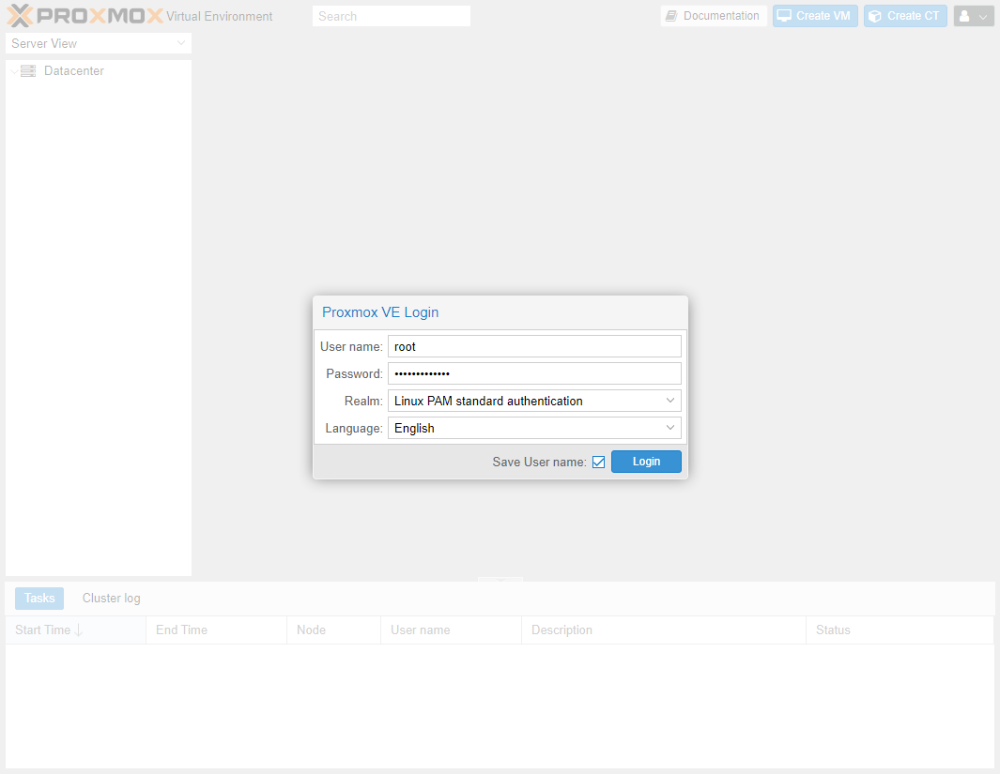

# Configuration de Proxmox
## Interface WEB
Maintenant que votre installation c'est déroulé sans accros, vous allez pouvoir vous connectez à l'interface web de Proxmox.
!!! Example "Se connecter"
	Pour ce faire il vous faut remplir dans votre navigateur ceci :
	
	```
	https://<ip du proxmox>:8006
	```
	
	Exemple :
	<div style="text-align: center">
	<a href="../../../assets/Proxmox/3.Configuration/config_1.gif">
		
	</a>
	</div>

## Login
Si l'étape d'avant s'est déroulée correctement vous devriez voir une page comme celle-ci :

<a href="../../../assets/Proxmox/3.Configuration/config_2.png"></a>

Vos identifiants de connexion sont ceux que vous avez définit dans [l'étape 4](../2.Installation/#etape-4-mot-de-passe-et-e-mail).

## Mise à jour
Félicitation, vous avez réussi à vous connectez (je l'espère) à votre interface de gestion de Proxmox. Maintenant nous allons devoir faire une petite manipulation afin que les mises à jour de paquets puissent s'éffectuer.

De base Proxmox est configuré pour utiliser le dépôt (repository) réservé aux entreprises payant du support au pret de **Proxmox Server Solutions GmbH** (La société qui développe Proxmox). Comme nous n'y avons pas accès car on est soit pauvre, soit radin. Nous devons configurer Proxmox pour qu'il utilise le dépôt de la communauté qui lui est gratuit.

!!! Attention "Attention !! Lisez ceci avant de faire la commande."
	Avant d'éxecuter bettement la commande voici une petit exeplication de cette commande : 
	```Bash 
	rm -rf /etc/apt/sources.list.d/pve-enterprise.list && echo "deb http://download.proxmox.com/debian/pve buster pve-no-subscription" >> /etc/apt/sources.list && apt update -y && apt dist-upgrade -y
	```
	
	Nous commencons par supprimer le fichier indiquant le dépôt entreprise
	```Bash
	rm -rf /etc/apt/sources.list.d/pve-enterprise.list
	```
	Ensuite nous "disons" à la commande écho d'écrire dans le fichier le texte qu'on lui à donné. Notez que le ">>" à la fin signifie "Ajouter au fichier". Si qu'un seul ">" est utilisé cela efface l'intégralité du fichier puis inscrit le texte donné.
	```Bash
	echo "deb http://download.proxmox.com/debian/pve buster pve-no-subscription" >> /etc/apt/sources.list
	```
	Maintenant nous allons mettre à jour la base de donnée interne des paquets.
	```Bash
	apt update
	```
	La base de donnée mise à jour cette fois on met à jour le système (Il est préférable sur Proxmox de faire un dist-upgrade plutôt qu'une simple apt upgrade).
	```Bash
	apt dist-upgrade -y
	```
